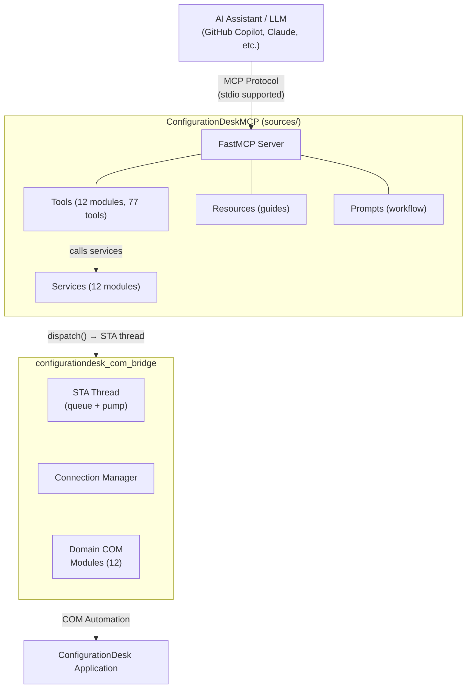
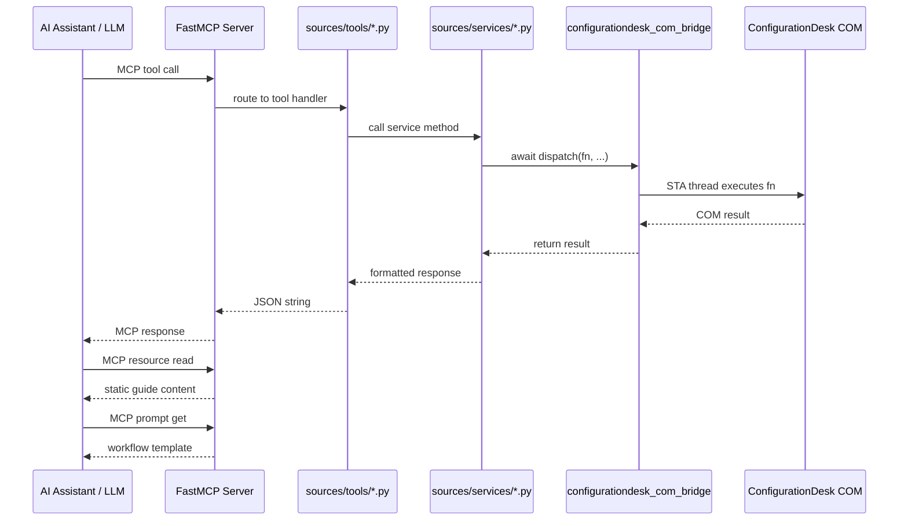

# ConfigurationDesk MCP Server — Architecture

## Table of Contents

- [1. Architecture Overview](#1-architecture-overview)
- [2. Package Structure](#2-package-structure)
- [3. Component Details](#3-component-details)
- [4. Data Flow](#4-data-flow)
- [5. Setup & Configuration](#5-setup--configuration)

---

## 1. Architecture Overview

The project is a **standalone MCP server** split into two packages:

- `configurationdesk_com_bridge` - Low-level COM bridge with a dedicated STA thread
- `ConfigurationDeskMCP` - FastMCP server exposing 77 tools, 11 resources, and 15 prompts



### Key Design Principles

| Principle | Implementation |
| --- | --- |
| **STA-thread isolation** | All COM calls run on a single STA thread via a task queue |
| **Async-safe dispatch** | `await dispatch(fn, *args)` bridges async MCP handlers to the STA thread |
| **Layered separation** | Tools → Services → COM Bridge → COM API |
| **Deferred connection** | COM connection is only established on the first `start_configurationdesk` call |
| **Deterministic errors** | COM errors marked `transient=False`; only genuinely retryable operations use `transient=True` |

---

## 2. Package Structure

```text
ConfigurationDeskMCP/
├── configurationdesk_com_bridge/     # COM automation library
│   ├── __init__.py                   # Public API: startup, shutdown, dispatch, ensure_connected
│   ├── connection.py                 # ConfigurationDeskConnection — COM lifecycle
│   ├── sta_thread.py                 # STAThread — dedicated COM apartment thread
│   ├── errors.py                     # BridgeError, BridgeConnectionError, etc.
│   ├── pyproject.toml                # Package: configurationdesk-com-bridge
│   ├── error_handling/
│   │   └── hresult.py               # HRESULT classification
│   └── domains/                      # COM domain wrappers
│       ├── app_management_com.py
│       ├── application_com.py
│       ├── build_com.py
│       ├── bus_access_com.py
│       ├── bus_config_com.py
│       ├── configuration_com.py
│       ├── hardware_com.py
│       ├── io_functions_com.py
│       ├── matrix_com.py
│       ├── model_topology_com.py
│       ├── project_com.py
│       ├── verify_com.py
│       └── working_view_com.py
│
├── ConfigurationDeskMCP/             # MCP server 
│   ├── pyproject.toml                # Package: configurationdesk-mcp-server
│   └── sources/
│       ├── main.py                   # Entry point — starts FastMCP
│       ├── config/settings.py        # Pydantic settings (env vars / .env)
│       ├── server/
│       │   ├── app.py                # FastMCP instance and COM bridge lifespan
│       │   └── registry.py           # Auto-discovers tool modules; registers resources/prompts
│       ├── tools/                    # 12 MCP tool modules (decorator-based)
│       ├── services/                 # 12 service modules (business logic)
│       ├── models/                   # Pydantic input models
│       ├── resources/                # MCP resources (automation guides)
│       ├── prompts/                  # MCP prompts (workflow templates)
│       └── utils/logger.py           # Logging configuration
│
└── README.md
```

---

## 3. Component Details

### 3.1 `configurationdesk_com_bridge`

| Module | Responsibility |
| --- | --- |
| `__init__.py` | Public API: `startup()`, `shutdown()`, `dispatch()`, `ensure_connected()`, `get_connection()` |
| `sta_thread.py` | `STAThread` class - runs `CoInitialize`, processes a task queue, pumps COM messages |
| `connection.py` | `ConfigurationDeskConnection` - `connect()` / `disconnect()` via `GetActiveObject` or `Dispatch` |
| `errors.py` | Exception hierarchy: `BridgeError`, `BridgeConnectionError`, `BridgeNotInstalledError`, `BridgeTimeoutError` |
| `domains/*.py` | Thin wrappers over COM collections (projects, models, hardware, bus configs, etc.) |

### 3.2 `ConfigurationDeskMCP`

| Layer | Modules | Responsibility |
| --- | --- | --- |
| **Server** | `app.py`, `registry.py` | FastMCP instance, lifespan (startup/shutdown bridge), tool registration |
| **Tools** | `tools/*.py` | `@mcp.tool` decorated functions — input validation, call service, format response |
| **Services** | `services/*.py` | Business logic - `await dispatch(com_domain_fn, ...)`, error handling |
| **Models** | `models/*.py` | Pydantic models for tool inputs |
| **Resources** | `resources/` | Static MCP resources (automation guide, tool reference) |
| **Prompts** | `prompts/` | Guided workflow prompts (`setup_project`, etc.) |
| **Config** | `config/settings.py` | `Settings` (pydantic-settings): transport, host, port, log level |

---

## 4. Data Flow



---

## 5. Setup & Configuration

### Install (editable / development)

```powershell
# From the workspace root (uv workspace):
uv sync --all-packages
```

### Run

```powershell
# stdio transport (default — for VS Code / Copilot)
uv run configurationdesk-mcp

# Or via Python module
uv run python -m sources.main
```

### Environment Variables

| Variable | Default | Description |
| --- | --- | --- |
| `MCP_TRANSPORT` | `stdio` | `stdio` supported; streamable HTTP is local opt-in only |
| `MCP_ENABLE_STREAMABLE_HTTP` | `false` | Required for loopback-only HTTP opt-in |
| `MCP_HOST` | `127.0.0.1` | Loopback host for optional HTTP only |
| `MCP_PORT` | `8000` | Bind port (HTTP only) |
| `LOG_LEVEL` | `INFO` | Logging verbosity |

Stdio is the supported public transport. Streamable HTTP is disabled by default and limited to loopback hosts in this release.

For the complete configuration reference (transports, COM settings, client
setup), see [Configuration reference](docs/configuration.md).

---

## Related Documentation

- [Extending guide](docs/extending.md) — add tools, domains, resources, prompts
- [COM Bridge Architecture](docs/com-bridge-architecture.md) — STA thread,
    `dispatch()`, COM lifecycle
- [Configuration reference](docs/configuration.md) — settings and client
    configuration
- [CONTRIBUTING.md](CONTRIBUTING.md) — development workflow and standards
- [Documentation index](docs/README.md) — documentation index