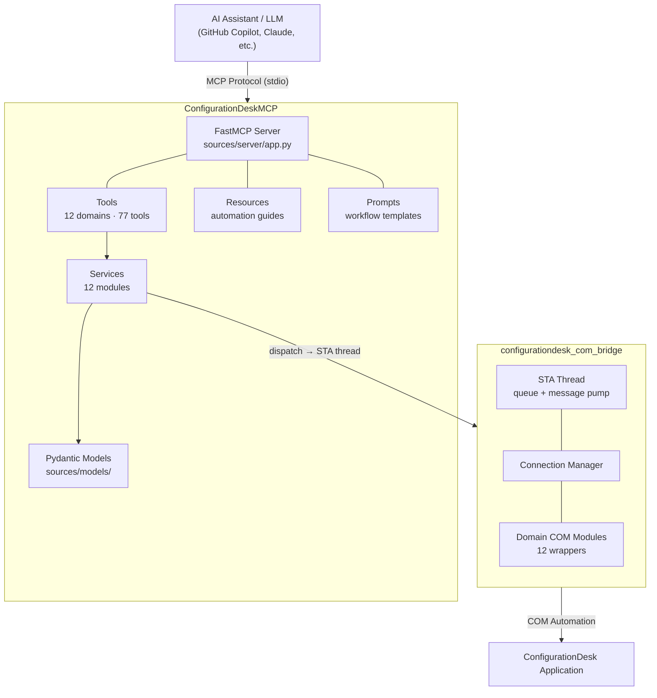

# ConfigurationDesk MCP Server

This MCP server automates dSPACE ConfigurationDesk and Bus Manager via their COM automation interfaces. It provides project, application, hardware, bus-configuration, communication-matrix, and build automation through **77 tools**, 11 resources, and 15 prompts.

ConfigurationDesk and Bus Manager are useful partners for AI-driven real-time application configuration: a AI agent can create and adapt a configuration, while the dSPACE tools provide the domain operations, COM automation, and build integration on a local Windows machine.

## Prerequisites

- **64-bit Windows 10/11** (COM automation requires Windows)
- [**uv**](https://docs.astral.sh/uv/), the Python package and project manager used to create the environment, install dependencies, and run the server from this checkout
- [**dSPACE ConfigurationDesk**](https://www.dspace.com/en/pub/home/products/sw/impsw/configurationdesk.cfm)installed with a valid license and registered for COM automation when using COM tools
- An MCP client, for example, VS Code, Cursor, Claude Code, or Claude Desktop

The server does not include ConfigurationDesk, a ConfigurationDesk license, hardware drivers, or project assets. You can install the server, print its version, and list tools without ConfigurationDesk. COM automation calls require a local licensed ConfigurationDesk installation. See the compatibility matrix for tested Python and ConfigurationDesk versions.

See the compatibility matrix for the supported Windows, Python, ConfigurationDesk, Bus Manager, and transport combinations.

## Installation

1. Open the repository folder.
2. Create the project environment and install runtime dependencies from the workspace manifests:

```powershell
uv sync --frozen --all-packages --no-dev
```

For contributor tools such as Ruff and pytest, use `uv sync --frozen --all-packages` instead.

## Using the ConfigurationDesk MCP Server with an MCP Client

1. In your MCP client, add a new MCP server.

2. Configure it as a **stdio** MCP server using the included launcher:

   ```powershell
   C:\path\to\ConfigurationDeskBusManagerMCP\ConfigurationDeskMCP.cmd
   ```

   For example, add the following entry to `.vscode/mcp.json`:

   ```json
   {
     "servers": {
       "configurationdesk-mcp": {
         "type": "stdio",
         "command": "C:\\path\\to\\ConfigurationDeskBusManagerMCP\\ConfigurationDeskMCP.cmd",
         "args": []
       }
     }
   }
   ```

A downloaded Windows executable can be configured the same way; see Windows Executable.

3. Reconnect or reload MCP servers in the client.

4. Run a quick check prompt, for example: "Call `start_configurationdesk()` if ConfigurationDesk is installed. If startup fails, call `diagnose_connection()`."

## Usage (Tool Order)

Recommended flow:

1. `start_configurationdesk()`
2. `create_project(...)` or `open_project(...)`
3. Use the appropriate domain tools, such as `add_application(...)`, `create_bus_configuration(...)`, or `build_application(...)`
4. `close_project(...)`
5. `stop_configurationdesk()`

Important:

- The COM connection is deferred until `start_configurationdesk()` is called.
- Close blocking dialogs in ConfigurationDesk before retrying a failed COM operation.

## Running the MCP Server

After the runtime setup, start the server with the included launcher:

```powershell
.\ConfigurationDeskMCP.cmd
```

Verify the installation without launching ConfigurationDesk:

```powershell
.\ConfigurationDeskMCP.cmd --version
.\ConfigurationDeskMCP.cmd --list-tools
.\ConfigurationDeskMCP.cmd --list-resources
.\ConfigurationDeskMCP.cmd --list-prompts
```

## At a Glance

| I want to... | Go to |
| --- | --- |
| Change transport, logging, or COM settings | [Configure](#configuring-the-mcp-server) · Configuration reference |
| Add a tool or a new domain | [Extend](#extending-the-mcp-server) · Extending guide |
| Understand the design | [Architecture](ARCHITECTURE.md) · COM bridge |
| Look up a tool | Tool reference |

## Windows Executable

GitHub Releases may include a downloadable Windows x64 executable. It bundles the Python server and open-source Python dependencies, but not ConfigurationDesk or its license.

```powershell
.\configurationdesk-mcp.exe --version
.\configurationdesk-mcp.exe --list-tools
```

Verify the matching SHA-256 checksum before use. See Windows Executable for download verification, MCP Inspector, and host configuration.

## MCP Host Configuration

Configure your MCP host to launch either the uv-installed entry point or the downloaded executable. For example:

```json
{
  "servers": {
    "configurationdesk-mcp": {
      "type": "stdio",
      "command": "C:\\path\\to\\configurationdesk-mcp.exe"
    }
  }
}
```

The supported public transport is local MCP stdio. See MCP Clients for host-specific configuration examples.

## Configuring the MCP Server

Every setting has a safe default - the server runs with **no configuration** in stdio mode. Override settings through process environment variables or a `.env`file. Copy [.env.example](.env.example) to `.env` to start from a documented template.

| Variable | Default | Description |
| --- | --- | --- |
| `MCP_TRANSPORT` | `stdio` | Supported public transport; `streamable-http` is a local opt-in only |
| `MCP_ENABLE_STREAMABLE_HTTP` | `false` | Required to enable loopback-only streamable HTTP |
| `MCP_HOST` | `127.0.0.1` | Loopback host for the optional HTTP transport |
| `MCP_PORT` | `8000` | Bind port (HTTP transport only) |
| `LOG_LEVEL` | `INFO` | `DEBUG` · `INFO` · `WARNING` · `ERROR` · `CRITICAL` (logs go to stderr) |
| `COM_TIMEOUT_MS` | `30000` | Timeout for a single COM call (500–120000) |
| `COM_LAUNCH_TIMEOUT_MS` | `30000` | Wait for ConfigurationDesk to start (5000–120000) |
| `COM_RECONNECT_ATTEMPTS` | `3` | Reconnects after a dropped COM connection (1–10) |
| `CONFIGURATIONDESK_PROGID` | `ConfigurationDesk.Application` | COM ProgID override (pin a version) |
| `CONFIGURATIONDESK_COMMON_PATH` | *(unset)* | Path to the dSPACE COM `Enums` helper package |

See the **full Configuration reference** for the loopback-only HTTP restriction, client setup, and details.

## Architecture



## Packages

| Package | Purpose |
| --- | --- |
| `configurationdesk-com-bridge` | Low-level COM bridge with dedicated STA thread |
| `configurationdesk-mcp-server` | FastMCP server — tools, resources, prompts |

## Tool Domains

| Domain | Module | Examples |
| --- | --- | --- |
| App Management | `app_management` | `start_configurationdesk`, `stop_configurationdesk` |
| Application | `application` | `add_application`, `remove_application`, `list_applications` |
| Project | `project` | `create_project`, `open_project`, `close_project` |
| Model Topology | `model_topology` | `add_model`, `analyze_models`, `replace_model` |
| Hardware | `hardware` | `add_hardware_platform`, `scan_hardware` |
| Bus Configuration | `bus_config` | `create_bus_configuration`, `assign_ecu_to_bus_config` |
| Communication Matrix | `matrix` | `add_communication_matrix`, `assign_matrix_to_bus_config` |
| Bus Access | `bus_access` | `create_io_function_block`, `assign_bus_access` |
| I/O Functions | `io_functions` | `add_io_function_block`, `list_io_function_block_types` |
| Configuration | `configuration` | `list_configuration` |
| Build | `build` | `build_application`, `get_build_result` |
| Working View | `working_view` | `create_working_view`, `export_working_view` |

The server exposes the domain tools listed above. For the full per-tool reference, see docs/tools/README.md. For ConfigurationDesk concepts, COM APIs, and feature semantics, use the documentation delivered with your licensed ConfigurationDesk release. This repository documents the MCP server and bridge; it does not republish ConfigurationDesk product documentation.

## Extending the MCP Server

The server is built to grow. Tools are **auto-discovered** - drop a module under `ConfigurationDeskMCP/sources/tools/` and its `@mcp.tool` handlers register automatically; there is no manifest to maintain.

A capability is four small pieces, one per layer:

```text
sources/models/<domain>_inputs.py        # Pydantic input model
configurationdesk_com_bridge/domains/<domain>_com.py   # thin COM wrapper (STA thread)
sources/services/<domain>_service.py      # business logic + error mapping
sources/tools/<domain>.py                 # @mcp.tool handler
```

Follow the step-by-step **Extending guide** (add a tool, add a domain, resources, prompts, testing). For ConfigurationDesk domain knowledge, refer to the documentation delivered with your licensed ConfigurationDesk release.

## Development

```powershell
# Lint and format (matches CI)
uv run ruff check .
uv run ruff format --check .

# Tests (unit + contract; no ConfigurationDesk needed)
uv run pytest ConfigurationDeskMCP/tests

# Confirm tools register
uv run configurationdesk-mcp --list-tools
```

CI runs the same checks on Windows across Python 3.11–3.13 ([.github/workflows/ci.yml](.github/workflows/ci.yml)).

## Documentation

| Document | What it covers |
| --- | --- |
| docs/README.md | Documentation index |
| [ARCHITECTURE.md](ARCHITECTURE.md) | Server architecture and data flow |
| docs/com-bridge-architecture.md | STA thread, `dispatch()`, COM lifecycle |
| docs/configuration.md | All settings, transports, client config |
| docs/extending.md | Add tools, domains, resources, prompts |
| docs/tools/README.md | Per-domain tool reference + glossary |
| docs/prompts/README.md | Prompt coverage and copy-and-adapt workflow requests |
| docs/prompts/tool-map.md | All 77 tools mapped to a prompt or domain guide |
| docs/clients.md | Connect VS Code, Claude, custom clients |
| docs/mcp-inspector.md | Test tools interactively in a browser |
| docs/windows-executable.md | Download and verify the Windows executable |

**Domain knowledge** (ConfigurationDesk concepts and COM APIs) is delivered with licensed ConfigurationDesk documentation. This repository documents the MCP server and bridge behavior.

## Troubleshooting

| Problem | Solution |
| --- | --- |
| `uv` not found | Install [uv](https://docs.astral.sh/uv/) and retry the launcher; uv manages a supported Python interpreter |
| `pywin32` import errors | Run `.\.venv\Scripts\python.exe -m pip install pywin32 --force-reinstall` |
| ConfigurationDesk COM errors | Ensure ConfigurationDesk is installed and licensed |
| MCP host cannot start the server | Verify the absolute executable path or `uv run configurationdesk-mcp` command in the host configuration |
| Conflicts with other Python versions installed in the system | Delete `.venv`; the next `ConfigurationDeskMCP.cmd` invocation recreates it |

## Support

For technical questions and issues related to the dSPACE MCP Servers and related GitHub repositories, please open a GitHub issue.

As a valued dSPACE customer, you are always welcome to contact dSPACE Support directly via [http://www.dspace.com/go/supportrequest](http://www.dspace.com/go/supportrequest).

## License

This project is licensed under the **Apache License, Version 2.0**. See [LICENSE](LICENSE) for the full text and [THIRD-PARTY-NOTICES.md](THIRD-PARTY-NOTICES.md) for dependency notices.