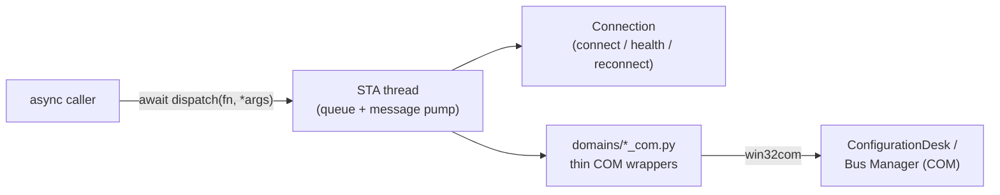

# configurationdesk-com-bridge

> Low-level COM bridge (SDK) for dSPACE **ConfigurationDesk** and **Bus Manager**. It owns a single STA thread, manages the COM connection lifecycle, and exposes one async gateway - `dispatch()` - for safely calling ConfigurationDesk's COM API from asynchronous Python.

This package is the SDK surface beneath the [ConfigurationDesk MCP Server](../ConfigurationDeskMCP/). It has **no dependency on the server** and can be used on its own to script ConfigurationDesk.

## Why it exists

ConfigurationDesk's automation API is COM (`IDispatch`), consumed from Python via `win32com` (pywin32). COM objects are **apartment-bound**: they may only be used from the thread that created them. Because an asyncio application has many threads, calling COM directly can result in an `RPC_E_WRONGTHREAD` error (`0x8001010E`) or worse, cause non-deterministic corruption of the state.

This bridge solves that by being the **single gatekeeper**: One dedicated STA thread creates and owns every COM object, and all work crosses into it through a queue. Callers never see a COM object on the wrong thread.



## Requirements

- **Windows** (COM automation is Windows-only)
- **Python 3.11+ (64-bit)** - the 32-bit COM client is unsupported
- [**dSPACE ConfigurationDesk**](https://www.dspace.com/en/pub/home/products/sw/impsw/configurationdesk.cfm)installed with a valid license and registered for COM automation (to actually connect)
- `pywin32` - installed via the `com` extra

## Installation

This package is a member of the repository's [uv](https://docs.astral.sh/uv/)workspace. From the repository root, `uv sync --all-packages` installs it (editable) alongside the server.

To work with it standalone (outside the workspace):

```powershell
uv pip install -e ".[com]"      # editable, with pywin32
```

## Public API

These are the **only** symbols code outside this package should import:

```python
from configurationdesk_com_bridge import (
    startup,  # start the STA thread (fast; COM connection is deferred)
    shutdown,  # disconnect COM and stop the STA thread
    dispatch,  # await dispatch(fn, *args, timeout_ms=None) -> result
    ensure_connected,  # establish the COM connection on first use
    get_connection,  # the active ConfigurationDeskConnection
    new_correlation_id,
    get_correlation_id,
    set_correlation_id,  # observability
)
from configurationdesk_com_bridge.errors import BridgeError  # + subclasses
from configurationdesk_com_bridge.domains import project_com  # COM wrappers
```

> Everything else (`sta_thread`, `connection`, `error_handling`) is an internal implementation detail.

### Minimal usage

```python
import asyncio
import configurationdesk_com_bridge as bridge
from configurationdesk_com_bridge.domains import project_com


async def main() -> None:
    await bridge.startup()  # STA thread up; no COM yet
    await bridge.ensure_connected()  # attach to / launch ConfigurationDesk
    conn = bridge.get_connection()

    # Domain functions take the connection as their first argument and MUST be
    # invoked via dispatch() so they run on the STA thread.
    projects = await bridge.dispatch(project_com.list_projects, conn)
    print(projects)

    await bridge.shutdown()


asyncio.run(main())
```

**The golden rule:** Never call a `*_com` function or touch a COM object directly. Always `await dispatch(fn, *args)`. `dispatch` accepts a **callable**(the domain function), not a string.

## Package layout

```text
configurationdesk_com_bridge/
├── __init__.py        # public API: startup, shutdown, dispatch, ensure_connected, ...
├── sta_thread.py      # STAThread: queue of tasks, CoInitialize, PumpWaitingMessages
├── connection.py      # ConfigurationDeskConnection: connect/disconnect/health/reconnect
├── errors.py          # BridgeError hierarchy
├── error_handling/
│   └── hresult.py     # HRESULT → BridgeError classification
└── domains/           # thin per-domain COM wrappers (project, model, hardware, bus, ...)
    ├── project_com.py
    ├── matrix_com.py
    ├── bus_config_com.py
    ├── ...
    └── verify_com.py  # shared post-condition verification helpers
```

## Error model

Every failure is a `BridgeError` subclass carrying a stable `error_code`, a `retryable` flag, a `recovery_hint`, and (when available) the `hresult`.

| Exception | `error_code` | Retryable |
| --- | --- | --- |
| `BridgeConnectionError` | `COM_DISCONNECTED` | yes |
| `BridgeTimeoutError` | `COM_TIMEOUT` | yes |
| `BridgeUiBlockedError` | `COM_UI_BLOCKING` | yes |
| `BridgeCircuitOpenError` | `BRIDGE_CIRCUIT_OPEN` | no |
| `BridgePreconditionError` | `BRIDGE_PRECONDITION` | no |
| `BridgeOperationError` | `BRIDGE_OPERATION_ERROR` | no |
| `BridgeNotInstalledError` | `BRIDGE_NOT_INSTALLED` | no |

`dispatch()` also performs an automatic health check before each call and attempts a single transparent reconnect if the connection went stale.

## Configuration

| Environment variable | Default | Description |
| --- | --- | --- |
| `CONFIGURATIONDESK_PROGID` | `ConfigurationDesk.Application` | COM ProgID override (pin a specific version). |
| `CONFIGURATIONDESK_COMMON_PATH` | *(unset)* | Path to the dSPACE COM `Enums` helper package. |

Timeouts and reconnect attempts are passed to `startup(...)` by the caller (the MCP server maps its `COM_*` settings to these).

## Design constraints (for contributors)

- **No server dependency.** This package must never import from `sources` / the MCP server. It is a standalone client-side abstraction.
- **Keep wrappers thin.** Domain *logic* (element resolution, verification policy, XPath strategy) belongs in the server's services layer, not here.
- **STA discipline.** Domain functions run on the STA thread - never `await`inside them; create and use COM objects only there.

See [docs/com-bridge-architecture.md](../docs/com-bridge-architecture.md) for the full design and the STA-threading rules.

## License

Licensed under the Apache License, Version 2.0. See the repository [LICENSE](../LICENSE) and [THIRD-PARTY-NOTICES.md](../THIRD-PARTY-NOTICES.md).