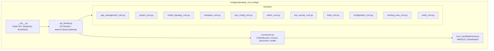
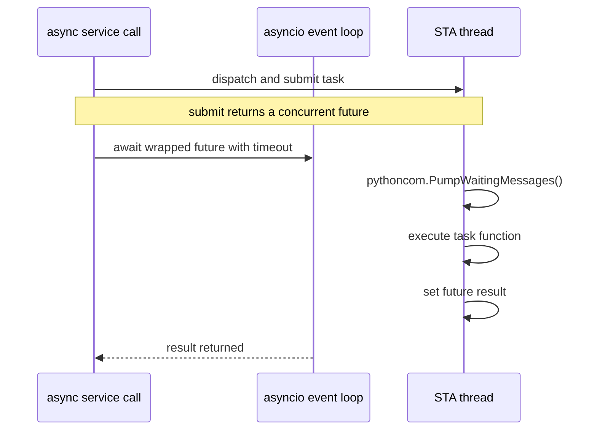
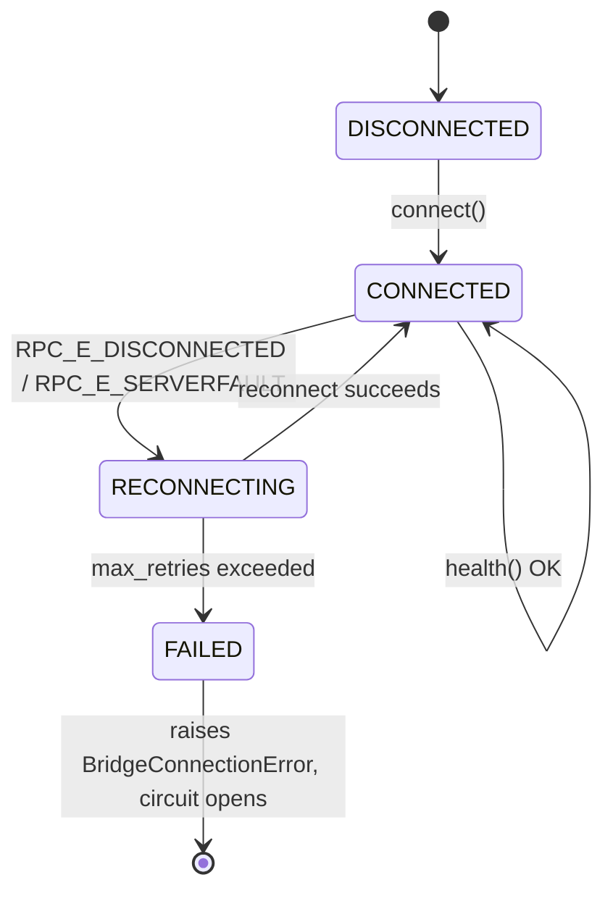

# COM Bridge Architecture — ConfigurationDesk MCP Server

> **Status:** Design Reference · **Layer:** 4 of 4 · **Scope:** Everything below `dispatch()` - all win32com, STA threading, COM lifecycle, error classification
>
> ⚠️ **This is the most critical layer. Read every section before writing any code here.**

---

## Table of Contents

 1. [Why a Dedicated COM Bridge](#1-why-a-dedicated-com-bridge)
 2. [STA Threading — Rules That Cannot Be Violated](#2-sta-threading--rules-that-cannot-be-violated)
 3. [Module Map](#3-module-map)
 4. [sta_thread.py — Design & Lifecycle](#4-stathreadpy--design--lifecycle)
 5. [connection.py — COM Lifecycle Management](#5-connectionpy--com-lifecycle-management)
 6. [hresult.py — HRESULT Classification](#6-hresultpy--hresult-classification)
 7. [domains/ — Per-Domain COM Wrappers](#7-domains--per-domain-com-wrappers)
 8. [COM Testing Considerations](#8-com-testing-considerations)
 9. [Performance Metrics for COM](#9-performance-metrics-for-com)
10. [Layering Enforcement — What COM Bridge Must NOT Do](#10-layering-enforcement--what-com-bridge-must-not-do)
11. [Implementation Checklist](#11-implementation-checklist)

---

## 1. Why a Dedicated COM Bridge

ConfigurationDesk's automation API is exposed via **COM Dispatch** (`IDispatch`). Python consumes this via `win32com.client.Dispatch` (pywin32).

COM objects are **apartment-bound**: They must only be used from the thread that created them. FastMCP runs on an asyncio event loop - multiple coroutines, different threads. If any tool handler calls COM directly:

- It runs on whichever thread asyncio dispatched it to (not the COM-owning thread).
- Windows raises `RPC_E_WRONGTHREAD` (`0x8001010E`) — or worse, silently corrupts state.
- The failure is non-deterministic and hard to reproduce.

The COM bridge exists to be the **single gatekeeper**: One dedicated STA thread owns all COM objects, and every tool call crosses into it via a queue.

---

## 2. STA Threading - Rules That Cannot Be Violated

| Rule | Consequence of Violation |
| --- | --- |
| All COM objects must be **created on the STA thread** | `CoInitializeEx` must be called before `Dispatch()` on the same thread |
| All COM method calls must run **on the STA thread** | `RPC_E_WRONGTHREAD` → silent data corruption or crash |
| **Never** `await` inside an STA thread callback | The STA thread is synchronous; awaiting creates a second event loop on the same thread → deadlock |
| The STA thread must pump Windows messages (`PumpMessages`) | COM callbacks (events, async notifications from ConfigurationDesk) require the message loop to process them |
| `CoUninitialize` must be called **on teardown on the STA thread** | Leaked COM references keep ConfigurationDesk alive after the MCP server exits |
| Only **one STA thread** per MCP server process | Multiple STA threads each create independent apartments - COM marshaling between them adds latency and complexity without benefit |
| Asyncio tools submit work via `loop.run_in_executor(sta_executor, ...)` | The executor must be a `ThreadPoolExecutor(max_workers=1)` initialised with `CoInitialize()` — not the default executor |

---

## 3. Module Map



**Only** `__init__.py` **(via** `dispatch()`**) is imported by code outside** `configurationdesk_com_bridge/`.All other modules in this package are internal implementation details.

---

## 4. sta_thread.py — Design & Lifecycle

### Purpose

`sta_thread.py` implements the only thread that talks to COM. It owns:

- A `threading.Thread` (daemon=False so teardown is deterministic)
- `pythoncom.CoInitialize()` called once at thread start
- A `queue.Queue` of `_Task` work items (`fn`, `args`, and a `concurrent.futures.Future`)
- `pythoncom.PumpWaitingMessages()` called between queue items

### Data Flow



### Startup (lifespan hook in app.py)

The server lifespan starts the STA thread only; the COM connection is **deferred**until the first `start_configurationdesk` tool call.

```python
# ConfigurationDeskMCP/sources/server/app.py
import configurationdesk_com_bridge as com_bridge


@asynccontextmanager
async def _lifespan(server):
    await com_bridge.startup(...)  # start STA thread; CoInitialize on it
    try:
        yield {}
    finally:
        await com_bridge.shutdown()  # disconnect COM; stop STA thread; CoUninitialize
```

### Dispatch API (the only public entry point)

`dispatch` takes a **callable** (a domain function), not a string. It runs the function on the STA thread and awaits the result.

```python
# configurationdesk_com_bridge/__init__.py


async def dispatch(fn: Callable[..., Any], *args: Any, timeout_ms: int | None = None) -> Any:
    """Submit fn(*args) to the STA thread and await the result.

    Raises:
        BridgeTimeoutError: the call exceeded timeout_ms.
        BridgeError subclass: any classified COM failure raised by fn.
    """
```

Services call `dispatch(domain_fn, conn, ...)`. `dispatch` - together with `startup`, `shutdown`, `ensure_connected`, and `get_connection` - is the only symbol imported from the bridge outside the package.

---

## 5. connection.py - COM Lifecycle Management

### Responsibilities

1. Create the root ConfigurationDesk application COM object.
2. Cache the object reference (used by domain wrappers).
3. Detect and recover from `RPC_E_DISCONNECTED`.
4. Expose a `health()` check used internally before COM operations.

### ProgID

The bridge connects with a default COM ProgID, overridable per deployment via the `CONFIGURATIONDESK_PROGID` environment variable. Public artifacts must not hardcode machine-specific ProgIDs.

```python
# configurationdesk_com_bridge/connection.py
PRODUCT_ID = "ConfigurationDesk.Application"  # env CONFIGURATIONDESK_PROGID overrides
```

Connection attaches to a running instance first (`GetActiveObject`) and falls back to launching one (`Dispatch`). If `DISP_E_MEMBERNOTFOUND` (`0x80020003`) is raised on a known method, a required COM object is not accessible - classified as `COM_MEMBER_NOT_FOUND` (`BridgeOperationError`).

### Connection State Machine



### Object Release on Failure

When `RPC_E_DISCONNECTED` is received, ALL cached COM object references must be released before reconnecting:

```python
def _release_all(self) -> None:
    """Release all COM references on the STA thread."""
    for attr in ("_app", "_enums"):
        obj = getattr(self, attr, None)
        if obj is not None:
            try:
                import win32com.client

                win32com.client.Dispatch.__del__(obj)
            except Exception:
                pass
            finally:
                setattr(self, attr, None)
    import gc

    gc.collect()  # force finalisation of any remaining COM wrappers
```

### UI-blocking calls

ConfigurationDesk runs automation on its UI (STA) thread. If a modal dialog is open, COM calls are rejected with `RPC_E_CALL_REJECTED` (`0x80010001`), which the bridge classifies as `COM_UI_BLOCKING` (`BridgeUiBlockedError`, retryable). The recovery hint asks the user to dismiss the dialog, then retry. Avoid triggering ConfigurationDesk dialogs during automation. For domain-specific dialog behavior, use the documentation delivered with your licensed ConfigurationDesk release.

---

## 6. hresult.py - HRESULT Classification

Implemented in `configurationdesk_com_bridge/error_handling/hresult.py`.

### Goal

Convert a raw `pywintypes.com_error` into a typed `BridgeError` subclass carrying:

- a machine-readable `error_code` (e.g. `COM_DISCONNECTED`)
- `retryable: bool`
- `recovery_hint: str`

The `dispatch()` layer attaches a `correlation_id` (a contextvar propagated across the logical tool invocation) for observability.

### Classification Logic

`classify_com_error(exc)` extracts the HRESULT, looks it up in `_HRESULT_MAP`, and falls back to facility-based classification:

```text
pywintypes.com_error
        │  classify_com_error(exc)
        â–Ľ
unsigned = hresult & 0xFFFFFFFF
        ├── unsigned in _HRESULT_MAP → (error_code, BridgeError subclass, retryable, hint)
        ├── facility == FACILITY_RPC (7) → BridgeConnectionError (COM_RPC_ERROR)
        └── default → BridgeOperationError (BRIDGE_UNKNOWN)
```

Representative mappings (`_HRESULT_MAP`):

| HRESULT | error_code | Class |
| --- | --- | --- |
| `0x80010001` RPC_E_CALL_REJECTED | `COM_UI_BLOCKING` | `BridgeUiBlockedError` |
| `0x80010108` RPC_E_DISCONNECTED | `COM_DISCONNECTED` | `BridgeConnectionError` |
| `0x80010007` RPC_E_SERVER_DIED | `COM_DISCONNECTED` | `BridgeConnectionError` |
| `0x80020003` DISP_E_MEMBERNOTFOUND | `COM_MEMBER_NOT_FOUND` | `BridgeOperationError` |
| `0x800706BA` RPC_E_SERVER_UNAVAILABLE | `COM_SERVER_UNAVAILABLE` | `BridgeConnectionError` |

### HRESULT Constants

```python
# Normalised to unsigned 32-bit
RPC_E_CALL_REJECTED = 0x80010001  # STA busy — message box blocking
RPC_E_DISCONNECTED = 0x80010108  # COM server (ConfigurationDesk) process died
RPC_E_SERVERFAULT = 0x80010105  # Exception propagated from COM server
RPC_E_WRONGTHREAD = 0x8001010E  # Called from wrong apartment (bug in bridge)
CO_E_SERVER_STOPPING = 0x80004007  # COM server shutting down
E_FAIL = 0x80004005  # General unspecified failure
E_INVALIDARG = 0x80070057  # Invalid argument
E_ACCESSDENIED = 0x80070005  # No license / insufficient rights
E_NOTIMPL = 0x80004001  # Method not implemented in this version
DISP_E_MEMBERNOTFOUND = 0x80020003  # Method/property not in current CD version
DISP_E_BADVARTYPE = 0x80020008  # Wrong type passed to IDispatch

RETRYABLE_HRESULTS = {RPC_E_CALL_REJECTED, RPC_E_DISCONNECTED, RPC_E_SERVERFAULT}
```

### Facility Extraction

```python
def _facility(hresult: int) -> int:
    return (hresult >> 16) & 0x1FFF
```

---

## 7. domains/ - Per-Domain COM Wrappers

Each domain module wraps the raw COM calls for one functional area. It is the only place where COM properties and methods are named.

### Rules for Domain Wrappers

1. **One function per COM operation** - no multi-step COM sequences in a single function.
2. **Synchronous only** - no `async def`, no `await`; these run on the STA thread.
3. **Return plain Python types** - `str`, `int`, `float`, `bool`, `list`, `dict`. Never return COM objects outside this layer.
4. **No error handling** - let `pywintypes.com_error` propagate to `sta_thread.py`; `error_handling/hresult.py` classifies it. Domain wrappers do not catch exceptions.
5. **Explicit property access** - do not use `getattr(com_obj, name)` dynamically; access each property by its literal name so ruff can audit them.

### Example: a domain wrapper

Domain functions take `connection` as their first argument and run on the STA thread. They are synchronous and never catch exceptions - classification happens in `error_handling/hresult.py`. (Illustrative shape; refer to `domains/project_com.py`for the real implementations.)

```python
# configurationdesk_com_bridge/domains/application_com.py
"""Low-level wrappers for the ConfigurationDesk application COM interface.

All functions run on the STA thread. They are synchronous.
They never catch exceptions — classification is in error_handling/hresult.py.
"""

from __future__ import annotations
from typing import TYPE_CHECKING

if TYPE_CHECKING:
    from win32com.client import CDispatch


def get_version(app: CDispatch) -> str:
    """Return the ConfigurationDesk version string, e.g. '2026-A'."""
    return str(app.Version)


def get_active_project_name(app: CDispatch) -> str | None:
    """Return the active project name, or None if no project is active."""
    proj = app.ActiveProject
    return str(proj.Name) if proj else None


def quit_application(app: CDispatch) -> None:
    """Send the Quit command to ConfigurationDesk. Does not wait for process exit."""
    app.Quit()
```

---

## 8. COM Testing Considerations

Testing COM-backed code requires a layered strategy because a live ConfigurationDesk is not available in CI.

### Layer 1: Unit Tests - Full COM Mock

The COM bridge is mocked at the `dispatch()` boundary. Tools are tested in isolation.

```python
# ConfigurationDeskMCP/tests/test_project_tools.py
import json
import pytest
from unittest.mock import AsyncMock, patch


@pytest.fixture
def mock_dispatch():
    with patch("configurationdesk_com_bridge.dispatch", new_callable=AsyncMock) as m:
        yield m


async def test_list_projects_returns_json(mock_dispatch):
    mock_dispatch.return_value = ["DemoProject"]
    result = await list_projects()
    data = json.loads(result)
    assert data["success"] is True
    assert "DemoProject" in data["projects"]
```

**What to test at this layer:**

- Pydantic validation rejection paths (missing field, wrong type, pattern mismatch)
- Tool response formatting (correct JSON shape, `isError` flag)
- Precondition guard logic

**What NOT to test at this layer:**

- COM object behaviour (mock returns whatever you set - not realistic)
- STA threading (the mock bypasses the thread entirely)

### Layer 2: COM Bridge Unit Tests - STA Thread with COM Mock

Test the `sta_thread.py` dispatch queue, timeout logic, and `error_handling/hresult.py` classification. Use `unittest.mock.MagicMock` to simulate `pywintypes.com_error`.

```python
# tests/test_hresult.py
import pywintypes
from configurationdesk_com_bridge.error_handling.hresult import classify_com_error
from configurationdesk_com_bridge.errors import BridgeConnectionError


def test_rpc_disconnected_maps_to_connection_error():
    # 0x80010108 RPC_E_DISCONNECTED == -2147417848 signed
    err = pywintypes.com_error(-2147417848, "RPC error", None, -1)
    result = classify_com_error(err)
    assert isinstance(result, BridgeConnectionError)
    assert result.retryable is True
```

**What to test at this layer:**

- HRESULT → error class mapping for every entry in the taxonomy table
- Timeout path (mock `asyncio.TimeoutError`)
- `RPC_E_WRONGTHREAD` detection (should raise `AssertionError` - it indicates a bridge bug)

### Operational COM Acceptance

The repository test suite is deterministic and does not require a licensed ConfigurationDesk installation. Validate real COM automation separately on a 64-bit Windows machine with ConfigurationDesk 2026-A or later installed and licensed. This operational acceptance is intentionally outside public CI.

---

## 9. Performance Metrics for COM

Standard API tests measure response time. COM automation requires additional metrics.

### 9.1 Marshaling Latency

**Definition:** Time for data to be serialized and passed between the Python MCP process and the ConfigurationDesk COM process.

**Measurement:**

```python
import time


async def measure_marshaling_latency() -> float:
    """Return round-trip time in ms for a minimal COM call."""
    start = time.perf_counter()
    await dispatch(domain_fn, conn)  # any lightweight COM read
    return (time.perf_counter() - start) * 1000
```

**Baseline targets:**

| Operation | Expected Latency |
| --- | --- |
| Property read (single value) | &lt; 5 ms |
| Method call (no data) | &lt; 10 ms |
| Variable read (one signal) | &lt; 20 ms |
| Variable read (100 signals) | &lt; 200 ms |
| Measurement start | &lt; 500 ms |

If marshaling latency exceeds these baselines, check the following:

1. ConfigurationDesk is not in a UI-blocking state.
2. The STA thread queue is not backed up with prior calls.
3. ConfigurationDesk is not under CPU load from a running build.

### 9.2 STA Bottleneck Detection

**Problem:** All COM calls are serialized through one STA thread. If 10 concurrent tool calls arrive, they queue and each waits for the previous one to complete.

**Measurement:**

```python
import asyncio, time


async def measure_sta_queue_depth() -> dict:
    """Fire 5 concurrent dispatches and measure actual vs expected time."""
    start = time.perf_counter()
    tasks = [dispatch(domain_fn, conn) for _ in range(5)]
    await asyncio.gather(*tasks)
    elapsed = (time.perf_counter() - start) * 1000
    return {
        "total_ms": elapsed,
        "per_call_ms": elapsed / 5,
        "queue_factor": elapsed / (5 * BASELINE_SINGLE_CALL_MS),
    }
```

**Interpretation:**

- `queue_factor` ≈ 5 → fully serialized (expected for STA)
- `queue_factor` &gt; 7 → STA thread is over-loaded; tool timeout budget must be increased

**Mitigation:** For read-only bulk operations (e.g., reading 50 variables), implement batching in the domain wrapper to make one COM call instead of 50.

### 9.3 Process Overhead

**Definition:** Memory and CPU footprint of ConfigurationDesk while the MCP server is connected.

**Measurement (PowerShell):**

```powershell
Get-Process ConfigurationDesk* |
    Select-Object Name, Id,
        @{N='CPU_s';E={$_.CPU}},
        @{N='MemMB';E={[math]::Round($_.WorkingSet/1MB,1)}}
```

**Guidelines:**

- Baseline memory (ConfigurationDesk idle, MCP connected): \~400–800 MB (varies by version)
- Each open project adds \~100–300 MB
- If memory grows continuously over 1 hour of MCP use → COM object leak in the bridge

**Object Leak Detection:**

```python
# In configurationdesk_com_bridge/connection.py health check
import gc, ctypes, win32com.client


def get_com_reference_count(com_obj) -> int:
    """Return the reference count of a COM object for leak detection."""
    ptr = ctypes.cast(int(com_obj), ctypes.POINTER(ctypes.c_ulong))
    return ptr[2]  # IUnknown::AddRef/Release counter offset
```

---

## 10. Layering Enforcement - What the COM Bridge Must NOT Do

| Forbidden Action | Reason |
| --- | --- |
| Import `mcp`, `fastmcp`, or `Context` | The bridge has no knowledge of MCP protocol |
| Call `ctx.info()`, `ctx.error()` etc. | No access to MCP context — log goes to stderr logger only |
| Return `pywintypes.com_error` or COM objects to callers | Only plain Python types and `BridgeError` subclasses leave this layer |
| Perform input validation | That is Layer 1 (Pydantic) |
| Perform domain precondition checks | That is Layer 2 |
| Implement retry logic | That is Layer 3 (Circuit Breaker) |
| Access `sources.tools.*` or `sources.server.*` | No upward dependencies |

---

## 11. Implementation Checklist

Before committing any `configurationdesk_com_bridge/` code:

- [ ] All COM object creation and method calls are inside functions that only run on the STA thread

- [ ] Only `dispatch`, `startup`, `shutdown`, `ensure_connected`, and `get_connection` are imported outside the package

- [ ] No `async def` inside the package except the `dispatch()` gateway in `__init__.py`

- [ ] Domain wrappers take `connection` first and return only plain Python types (`str`, `int`, `float`, `bool`, `list`, `dict`)

- [ ] `CoUninitialize` is called on STA thread teardown

- [ ] Cached COM references are released on `RPC_E_DISCONNECTED` before reconnecting

- [ ] `error_handling/hresult.py` covers the HRESULT codes in the taxonomy table

- [ ] Tests exist for every HRESULT → `BridgeError` mapping

- [ ] No `print()` anywhere in the package (ruff T201)

- [ ] `ruff check configurationdesk_com_bridge` passes with zero violations

---

*See also: [ARCHITECTURE.md](../ARCHITECTURE.md) · [extending.md](extending.md) · [configurationdesk_com_bridge/README.md](../configurationdesk_com_bridge/README.md)*