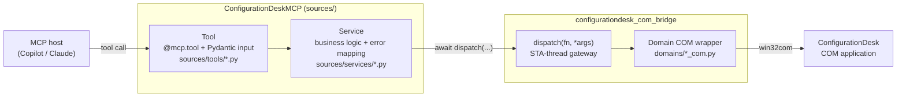

# Extending the ConfigurationDesk MCP Server

> **Audience:** developers adding new automation capabilities to the server. **Outcome:** After reading this guide you can add a new tool, a whole new tool domain, resources, and prompts - and know exactly where each piece of code belongs, how it is registered, and how to test it.

If you only want to *run* the server, refer to the [README](../README.md) and [Configuration reference](configuration.md) instead.

---

## 1. The mental model: four layers, one direction

Every tool call flows through the same four layers. Data flows **down** on the way in and **up** on the way out - layers never skip or reverse.



| Layer | Folder | Responsibility | May import |
| --- | --- | --- | --- |
| **Tool** | `ConfigurationDeskMCP/sources/tools/` | Declare the tool, validate input (Pydantic), call one service function, return its JSON string | `sources.services`, `sources.models`, `sources.server.app` |
| **Service** | `ConfigurationDeskMCP/sources/services/` | Business logic, `await dispatch(...)`, map `BridgeError` → response envelope | `configurationdesk_com_bridge`, `sources.models`, `sources.tools._responses` |
| **COM domain** | `configurationdesk_com_bridge/domains/` | Thin synchronous COM calls; run **on the STA thread**; verify the result | `win32com`, `configurationdesk_com_bridge.domains.verify_com` |
| **Bridge core** | `configurationdesk_com_bridge/` | STA thread, connection lifecycle, `dispatch()`, error classification | (internal only) |

### Two rules that must never be broken:

1. **All COM access goes through** `dispatch(...)`**.** Never touch a COM object directly from an async tool or service - it raises a `RPC_E_WRONGTHREAD`. Refere to [COM Bridge Architecture](com-bridge-architecture.md).
2. **The bridge must not import from the server.** `configurationdesk_com_bridge`is a standalone SDK. Domain *logic* (which element to resolve, what to verify, XPath strategy) belongs in `sources/services`, not in the bridge.

---

## 2. Where domain knowledge comes from

This repository documents the **MCP Server**. It does **not** re-document ConfigurationDesk itself. For any **domain** question — what a bus configuration part is, which COM property exposes a baud rate, what a channel set means, or the exact COM method to call — use the documentation delivered with your licensed ConfigurationDesk release. The existing tool specs under docs/tools/ map the MCP surface to product terminology.

> **Convention:** When you add a domain capability, cite the manual title and section, or the exact API reference URL, in the COM wrapper docstring so the next developer can verify it.

---

## 3. How registration works (the code is the control surface)

There is **no manifest and no allowlist**. Tools are auto-discovered:

- `sources/server/registry.py`imports **every public module** under `sources/tools/` at startup. Importing a module runs its `@mcp.tool` decorators, which register the tools.
- Modules whose name starts with `_` (e.g., `_responses.py`) are treated as helpers and skipped.
- Resources and prompts are imported explicitly at the bottom of `registry.py`.

Consequences:

- **To add tools to an existing domain:** Edit the module of that domain. Do not touch anything else.
- **To add a new domain:** Drop a new `sources/tools/<name>.py`. It is discovered automatically.
- **To remove a domain:** Delete the module.

Verify what is registered at any time, without a host:

```powershell
uv run configurationdesk-mcp --list-tools
```

### Public tool naming and surface policy

Public tool names describe an outcome, not a one-to-one ConfigurationDesk COM member. Use these verb conventions when adding tools:

- `create_*` creates a standalone, named lifecycle entity owned by the current project or application, such as a project, bus configuration, application process, working view, or bus I/O function block.
- `add_*` imports an existing artifact or adds a contained entity, capability, or relationship to an existing parent context. Examples include adding an application to a project, importing a communication matrix or model, and adding a feature to a bus element.
- `assign_*` creates or updates a relationship between existing entities; `set_*`, `list_*`, `find_*`, `remove_*`, and `get_*` retain their usual operation meanings.

Existing names are stable API contracts. Do not rename a tool only to reclassify its verb; Document the distinction and use the convention for new tools instead.

Audit the surface before each release and before adding a new tool domain. Chose workflow-level tools over thin COM-method wrappers, review available usage and success-rate telemetry, and consolidate or deprecate low-value, granular tools when a clear workflow tool already achieves the outcome. Store reusable implementation details in services or helper modules instead of publishing them as MCP tools.

---

## 4. Walkthrough - add a tool to an existing domain

We will add a `rename_project` tool to the **project** domain. Every existing domain follows this exact four-file pattern; `project` is the reference example.

### Step 1 - Input model (`sources/models/<domain>_inputs.py`)

Define a Pydantic model. Give **every field a description with an example** — the description becomes the JSON Schema the model host sees.

```python
# sources/models/project_inputs.py
class RenameProjectInput(BaseModel):
    name: str = Field(description="Current project name, e.g. 'MyTestProject'")
    new_name: str = Field(description="New project name, e.g. 'RenamedProject'")
```

> Tools that take no arguments do not need an input model — declare the handler with no parameters (see `list_projects`).

### Step 2 - COM wrapper (`configurationdesk_com_bridge/domains/<domain>_com.py`)

A plain synchronous function. It receives the live `connection` as its **first argument**, does the COM work, and returns a small `dict` describing the outcome. Verify the result with a `verify_com` helper so the service can report `verified=True`.

```python
# configurationdesk_com_bridge/domains/project_com.py
def rename_project(connection, name: str, new_name: str) -> dict[str, Any]:
  """Rename a project. Domain ref: ConfigurationDesk API Reference, ICaProject.Name."""
    app = connection.app
    if not app.Projects.Contains(name):
        return {"verified": False, "detail": f"Project '{name}' not found"}
    app.Projects.Item(name).Name = new_name
    ok, detail = verify_active_project(connection, new_name)
    return {"name": new_name, "verified": ok, "detail": detail}
```

**STA-thread rules for this function** (see [COM Bridge Architecture](com-bridge-architecture.md)):

- It runs on the STA thread — never `await` inside it.
- It must not import anything from `sources/` (no server dependency).
- Keep it thin: one COM operation plus verification. Decisions about *which*element to act on belong in the service layer.

### Step 3 - Service (`sources/services/<domain>_service.py`)

Async. Get a live connection, `await dispatch(...)` the COM function, and convert the result (or any `BridgeError`) into a JSON response string.

```python
# sources/services/project_service.py
async def rename_project(name: str, new_name: str) -> str:
    try:
        conn = await _get_live_connection()
        result = await dispatch(project_com.rename_project, conn, name, new_name)
        if result.get("verified"):
            return success_response(message=f"Project renamed to '{new_name}'", verified=True)
        return error_response(result.get("detail", "Rename failed"), transient=False)
    except BridgeError as exc:
        return tool_error_result(exc)  # structured envelope + correlation id
    except Exception as e:
        logger.exception("Error renaming project")
        return error_response(str(e), transient=False)
```

The `try/except BridgeError → tool_error_result` block is mandatory and identical across services — copy it. It produces the `error_code` / `category` / `recovery_hint` / `next_action` fields the model relies on.

### Step 4 — Tool handler (`sources/tools/<domain>.py`)

First, declare the tool, Then set the [annotations](#6-tool-annotations), and forward to the service. The handler remains a one-liner - with no logic.

```python
# sources/tools/project.py
from sources.models.project_inputs import RenameProjectInput  # add to existing import


@mcp.tool(
    name="rename_project",
    description=(
        "Rename an existing ConfigurationDesk project. "
        "PREREQUISITE: ConfigurationDesk must be running and the project must exist."
    ),
    annotations={
        "readOnlyHint": False,
        "destructiveHint": False,
        "idempotentHint": False,
        "openWorldHint": False,
    },
)
async def rename_project(input: RenameProjectInput) -> str:
    return await svc.rename_project(input.name, input.new_name)
```

### Step 5 - Verify it registered

```powershell
.\.venv\Scripts\configurationdesk-mcp.exe --list-tools | Select-String rename_project
```

### Step 6 - Test

Add a deterministic contract test that needs no ConfigurationDesk installation. See [§11 Testing](#11-testing). Validate real COM behavior separately on a licensed ConfigurationDesk machine when the change needs operational acceptance.

The whole pattern is as follows: **input model → COM wrapper → service → tool**.

---

## 5. Walkthrough - add a whole new domain

Adding a domain involves the same four steps, plus creating the files. Suppose you add a `working_view` domain:

1. `configurationdesk_com_bridge/domains/working_view_com.py` — COM wrappers.
2. `sources/services/working_view_service.py` — services.
3. `sources/models/working_view_inputs.py` — input models.
4. `sources/tools/working_view.py` — `@mcp.tool` handlers (imports the service as `svc` and the models).

No registration step is required — `registry.py` discovers `sources/tools/working_view.py` automatically. Restart the server (or re-run `--list-tools`) and the new tools appear.

Update these docs alongside the code:

- Add a row to the domain table in the [README](../README.md) and docs/tools/README.md.
- Add a tool-spec page under `docs/tools/` if the domain is non-trivial.

---

## 6. Tool annotations

Every tool declares four MCP annotations. They are advisory hints the host uses for safety prompts and batching — set them honestly.

| Annotation | Set `true` when… |
| --- | --- |
| `readOnlyHint` | The tool does not modify project state (a `list_*` / `get_*` tool). |
| `destructiveHint` | The tool can delete, replace, overwrite, unload, or disrupt an existing project or deployed state. |
| `idempotentHint` | Calling twice with the same input yields the same end state. |
| `openWorldHint` | The tool touches external systems (hardware scan, network, build). |

Guidance:

- Set `readOnlyHint: false` for every state-changing tool, including safe additive operations.
- Set `destructiveHint: true` when any supported argument can remove, replace, overwrite, unload, deploy, or activate existing state, even if that behavior is optional.
- Keep `destructiveHint: false` for operations that only add new state without replacing existing state.
- A read-only tool is almost always `idempotentHint: true`, `destructiveHint: false`.
- A `create_*` tool that fails if the object exists is **not** idempotent.
- `scan_hardware`, `build_application`, and platform tools are `openWorldHint: true`.

---

## 7. The response envelope

Tools return a **JSON string**, never a Python object. Use the helpers in `sources/tools/_responses.py`and `sources/models/envelope_builder.py`.

| Helper | When to use | Shape |
| --- | --- | --- |
| `success_response(**fields)` | State change confirmed | `{"success": true, "verified": true, ...}` |
| `unverified_response(**fields)` | COM call succeeded but state could not be confirmed | `{"success": true, "verified": false, ...}` |
| `error_response(msg, transient=...)` | Generic failure raised in the service | `{"success": false, "error_code": ..., "retryable": ..., "recovery_hint": ..., "next_action": ...}` |
| `tool_error_result(exc)` | A `BridgeError` was caught | Same as above, enriched with `category`, `hresult`, `correlation_id` |

**Verification policy:** Mutating tools should confirm the change (via a `verify_com` helper) and only then return `verified=True`. If you cannot confirm it, return `unverified_response(...)` so the model knows to re-check rather than assume success.

---

## 8. Error handling

The bridge raises a typed exception hierarchy. The service catches an `BridgeError`and hands it to `tool_error_result`, which maps the type to a stable `error_code`, a `category`, and concrete `next_action` guidance.

| Exception | `error_code` | `category` | Retryable |
| --- | --- | --- | --- |
| `BridgeConnectionError` | `COM_DISCONNECTED` | `CONNECTION` | yes |
| `BridgeTimeoutError` | `COM_TIMEOUT` | `TIMEOUT` | yes |
| `BridgeUiBlockedError` | `COM_UI_BLOCKING` | `UI_BLOCKING` | yes |
| `BridgeCircuitOpenError` | `BRIDGE_CIRCUIT_OPEN` | `CIRCUIT` | no |
| `BridgePreconditionError` | `BRIDGE_PRECONDITION` | `PRECONDITION` | no |
| `BridgeOperationError` | `BRIDGE_OPERATION_ERROR` | `OPERATION` | no |
| `BridgeNotInstalledError` | `BRIDGE_NOT_INSTALLED` | — | no |

In a **COM wrapper**, raises a `BridgeOperationError` (or a more specific subclass) with a `recovery_hint` for domain failures the user can fix. Do **not** invent new `error_code` strings on the server side — they must originate in the bridge so clients can rely on them.

---

## 9. Adding resources and prompts

Both are imported explicitly in `registry.py`, so add to an existing module or register the new module there.

**Resource** — read-only data fetched by URI. Use the `configurationdesk://`scheme and add to `sources/resources/domain_resources.py`:

```python
@mcp.resource(
    "configurationdesk://reference/baud-rates",
    name="baud_rate_reference",
    title="CAN and LIN baud-rate reference",
    description="Common CAN/CAN-FD/LIN baud rates",
    mime_type="text/markdown",
)
def get_baud_rates() -> str:
    return _BAUD_RATES
```

Every resource needs a concise, human-readable `title` in addition to its stable `name` and URI. MCP hosts use the title as the user-facing label.

**Prompt** — a guided workflow template. Add an `@mcp.prompt(...)` function to a module under `sources/prompts/` (create one for a new domain and import it in `registry.py`).

---

## 10. Coding standards

These are enforced by review and tooling:

- **Naming:** Public tool names are `snake_case` verbs (`create_project`, `list_models`). Keep the Python tool handler name identical to the public tool name: FastMCP derives generated input and output schema titles from it. Service and COM helpers may use shorter internal names.

- **Type hints** on all public functions; `from __future__ import annotations`at the top of every module.

- **No COM in the server layer**, no `sources` import in the bridge.

- **Lint/format with Ruff** (config in `ruff.toml`):

  ```powershell
  ruff check .
  ruff format .
  ```

- **Offline syntax gate** when COM/deps are unavailable:

  ```powershell
  py -3.11 -m py_compile <file>
  ```

---

## 11. Testing

Tests live in `ConfigurationDeskMCP/tests/`. They are deterministic and do not need a ConfigurationDesk installation.

```powershell
uv run pytest ConfigurationDeskMCP/tests -v                 # unit + contract
uv run pytest ConfigurationDeskMCP/tests/test_smoke.py -v    # fast smoke check
```

| Test file | Verifies |
| --- | --- |
| `tests/domains/test_<domain>.py` | Every tool in a domain runs through its service with a faked bridge |
| `tests/domains/test_tool_coverage.py` | Every registered tool is exercised by exactly one domain module |
| `test_tool_registration.py` | Your new tool is discovered and exposed |
| `test_runtime_contracts.py` / `test_runtime_guards.py` | Response-envelope shape and guard behavior |
| `test_verification.py` | Verification helpers report state correctly |
| `test_function_port_properties.py` / `test_bus_element_properties.py` | Property alias resolution, value validation, and normalization |
| `test_mcp_contracts.py` | Registered tool/resource metadata, schema, annotation, pagination, and response-contract checks |

When you add a tool, add it to the matching `tests/domains/test_<domain>.py`module (call it and list it in that module's `COVERS` tuple). The `test_tool_coverage.py` guard fails until every registered tool has a per-domain test.

---

## 12. Pre-PR checklist

Before opening a pull request, follow [CONTRIBUTING.md](../CONTRIBUTING.md) and [GOVERNANCE.md](../GOVERNANCE.md):

- [ ] `ruff check .` and `ruff format .` are clean.

- [ ] `uv run pytest ConfigurationDeskMCP/tests` passes.

- [ ] `--list-tools` shows the new/renamed tools.

- [ ] New tools have honest annotations and a description that states prerequisites.

- [ ] Domain facts in COM wrappers cite an official manual section or API reference URL.

- [ ] Docs updated: inventory counts, domain tables in [README](../README.md)and docs/tools/README.md, the tool-to-prompt map, and affected tool-spec pages (including pagination when applicable).

- [ ] No `sources` import leaked into `configurationdesk_com_bridge`.

---

## Related documentation

- [Architecture overview](../ARCHITECTURE.md)
- [COM Bridge Architecture](com-bridge-architecture.md) — the STA thread and `dispatch()`
- [Configuration reference](configuration.md)
- Tool reference
- [MCP Inspector guide](mcp-inspector.md) — test tools interactively
- [CONTRIBUTING](../CONTRIBUTING.md)