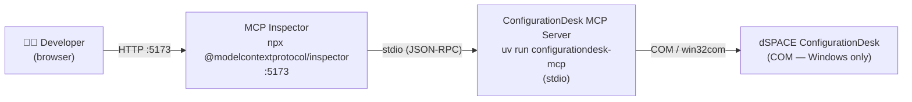
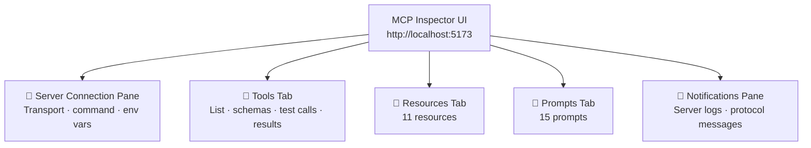
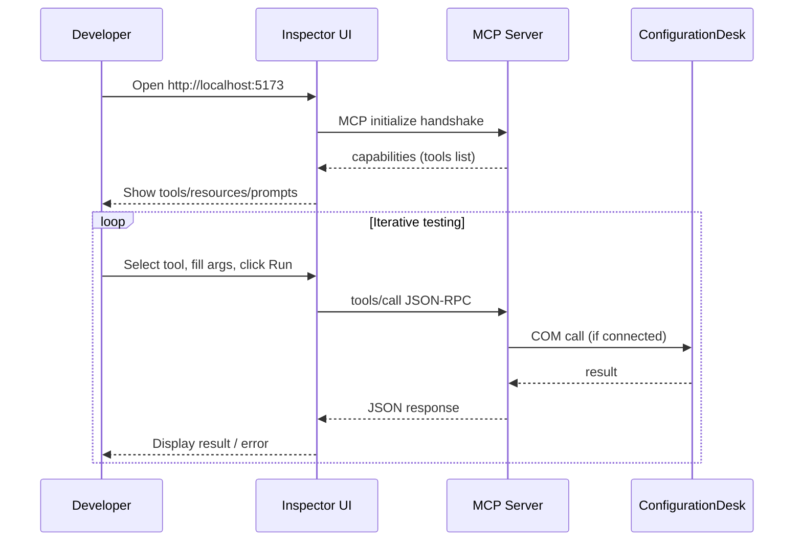

# MCP Inspector — Developer Guide

The [MCP Inspector](https://github.com/modelcontextprotocol/inspector) is an interactive browser-based developer tool for exploring, testing, and debugging MCP servers **without** needing a full LLM host (Claude, VS Code Copilot, etc.).

This guide explains how to use it with the ConfigurationDesk MCP server.

---

## What It Is

MCP Inspector is an external `npx` package maintained by the MCP project. It is **not** part of this repository — it lives on npm as `@modelcontextprotocol/inspector`. The integration here is a single launcher script (`scripts/inspect.ps1`) that wires the Inspector to our server.

```text
External tool:  npx @modelcontextprotocol/inspector
Our launcher :  scripts/inspect.ps1
```

---

## Architecture



The Inspector spawns the MCP server as a **child process** via stdio transport. The browser UI proxies all MCP messages through the Inspector process.

> **Note:** COM calls to ConfigurationDesk only work on Windows with ConfigurationDesk installed. The Inspector itself and most of its tabs (Tools list, schema inspection, etc.) work without a live ConfigurationDesk — only tool *execution* requires the COM connection.

---

## Quick Start

### Prerequisites

| Requirement | Version | Check |
| --- | --- | --- |
| Node.js (for `npx`) | ≥ 18 | `node --version` |
| uv | any recent | `uv --version` |
| ConfigurationDesk *(for tool execution)* | any supported | — |

### Launch

```powershell
# From repo root
./scripts/inspect.ps1
```

The script will:

1. Verify that `npx` is on PATH (fails with a helpful message if Node.js is missing).
2. Resolve the server command — the `.venv` entry point, or `uv run configurationdesk-mcp` as a fallback.
3. Start `npx -y @modelcontextprotocol/inspector` against that command.
4. Open the Inspector in your browser (it prints the local URL).

Press **Ctrl+C** to stop both the Inspector and the server.

---

## Inspector Tabs



---

### Tools Tab

All `@mcp.tool()` functions registered in `sources/tools/**` appear here. Registered via `sources/server/registry.py`.

For each tool, you can:

- Read the **description** and **input schema** (Pydantic model → JSON Schema).
- Fill in arguments and **execute** the tool live.
- Inspect the raw **JSON response** and any error envelope.

---

### Resources Tab

Resources are **read-only data** the Inspector and LLMs can fetch by URI. All resources are always available — no ConfigurationDesk connection is required. Registered in `sources/resources/domain_resources.py`.

| URI | Name | Format |
| --- | --- | --- |
| `configurationdesk://reference/tool-selection` | tool_selection_reference | Markdown |
| `configurationdesk://reference/valid-values` | valid_values_reference | Markdown |
| `configurationdesk://reference/error-recovery` | error_recovery_reference | Markdown |
| `configurationdesk://guides/automation` | automation_guide | Markdown |
| `configurationdesk://guides/tools` | tool_categories | Markdown |
| `configurationdesk://guides/workflow-examples` | workflow_examples | Markdown |
| `configurationdesk://reference/xpath` | xpath_reference | Markdown |
| `configurationdesk://reference/features` | feature_reference | Markdown |
| `configurationdesk://reference/function-port-properties` | function_port_properties | JSON |
| `configurationdesk://reference/bus-element-properties` | bus_element_properties | JSON |
| `configurationdesk://status` | application_status | JSON (live connection / project state) |

There are **11 resources** and no URI templates. Only the
`configurationdesk://status` reflects live state — re-fetch it after calling
`start_configurationdesk`.

**How to use in the Inspector:**

1. Open the **Resources** tab in the browser UI.
2. Click any resource URI to fetch its content.
3. Re-fetch `configurationdesk://status` after `start_configurationdesk` to see the live connection and active project.

**Adding a new resource:** Add an `@mcp.resource("configurationdesk://...")` function to `sources/resources/domain_resources.py` (already imported by `registry.py`). See [Extending § 9](extending.md#9-adding-resources-and-prompts).

---

### Prompts Tab

Prompts are **workflow templates** that guide an LLM through a ConfigurationDesk task. The Inspector lets you fill in any arguments and preview the generated messages before sending them to a model.

The server registers **15 prompts** across two modules under `sources/prompts/`:

| Module | Prompts | Focus |
| --- | --- | --- |
| `configurationdesk_prompts.py` | 1 | Bus Manager restbus simulation workflow |
| `individual_setup_prompts.py` | 14 | Focused, single-task prompts for the most common tools |

**How to use in the Inspector:**

1. Open the **Prompts** tab in the browser UI.
2. Select a prompt and fill in any parameter fields.
3. Click **Get Prompt** to preview the generated message(s).

**Adding a new prompt:** add an `@mcp.prompt(...)` function to a module under `sources/prompts/` (import a new module in `registry.py` under `# Prompts`). See [Extending § 9](extending.md#9-adding-resources-and-prompts).

---

### Notifications Pane

Streams all `ctx.info()` / `ctx.warning()` / `ctx.error()` messages emitted by tool handlers plus the raw MCP protocol frames — useful for tracing COM errors.

---

## Development Workflow



**Recommended steps:**

1. **Start with the Tools tab** — verify all expected tools are listed with correct descriptions and schemas.
2. **Check capability negotiation** — the Server Connection pane shows what the server advertised.
3. **Test discovery without ConfigurationDesk first** — verify tools, resources, and prompts are listed; COM-dependent tools return a structured error when disconnected.
4. **Use the Notifications pane** when debugging — COM errors and structured log messages appear there in real-time.
5. **After changing a tool** — restart the Inspector (`Ctrl+C`, re-run the script) and reconnect; no hot-reload.

---

## Troubleshooting

| Symptom | Likely Cause | Fix |
| --- | --- | --- |
| `npx not found` | Node.js not installed | Install from <https://nodejs.org> |
| Browser shows blank page | Inspector still starting | Wait 3–5 s and refresh |
| Tool returns `BridgeError` | ConfigurationDesk not running or not connected | Start ConfigurationDesk, call `start_configurationdesk` first |
| Tool not visible in Inspector | New tool module not picked up | Restart the Inspector (no hot-reload); tools auto-register from `sources/tools/` |
| Schema shows `{}` for a tool | Pydantic input model missing or wrong type | Check `sources/models/<domain>_inputs.py` |
| **Resources tab is empty** | `domain_resources` not imported in `registry.py` | Ensure `import sources.resources.domain_resources` is present |
| **Prompts tab is empty** | Prompt modules not imported in `registry.py` | Ensure the `sources.prompts.*` imports are present |
| `configurationdesk://status` shows `connected: false` | `start_configurationdesk` not called yet | Call `start_configurationdesk` in the Tools tab, then re-fetch |

---

## Restarting Inspector

MCP Inspector always launches its own stdio child process. After changing the tool,
resource, prompt, service, or bridge code, stop Inspector with **Ctrl+C** and
run `./scripts/inspect.ps1` again. A running Inspector does not hot-reload
server code.

---

## Related Documentation

| File | Purpose |
| --- | --- |
| [docs/extending.md](extending.md) | Add tools, domains, resources, and prompts |
| [docs/configuration.md](configuration.md) | Settings, transports, client config |
| [ARCHITECTURE.md](../ARCHITECTURE.md) | Four-layer server architecture |
| [docs/com-bridge-architecture.md](com-bridge-architecture.md) | STA thread, `dispatch()`, COM lifecycle |
| [scripts/inspect.ps1](../scripts/inspect.ps1) | Inspector launcher used by this guide |
| [sources/resources/domain_resources.py](../ConfigurationDeskMCP/sources/resources/domain_resources.py) | The 11 resources |
| [sources/prompts/](../ConfigurationDeskMCP/sources/prompts/) | The 15 workflow prompts |
| [sources/server/registry.py](../ConfigurationDeskMCP/sources/server/registry.py) | Auto-discovery of tools; registration of resources & prompts |
